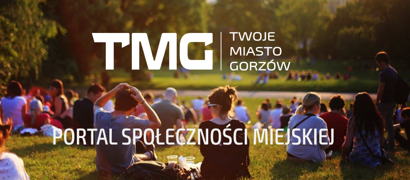

# O projekcie "Twoje Miasto Gorzów - platforma społeczności miejskiej"

## Informacje ogólne
**"Twoje Miasto Gorzów - platforma społeczności miejskiej"** (TMG) jest projekt wdrażający ideę **Smart City 3.0**, mający na celu zwiększenie zaangażowania obywatelskiego mieszkańców oraz integrację środowisk miejskich (organizacji pozarządowych, przedsiębiorców, instytucje publiczne) przy użyciu technologii informacyjno-komunikacyjnych (TIK).  

Platforma TMG składa się z następujących rozwiązań:
 * platforma publicystyczna [Ghost](https://ghost.org/docs/);
 * platforma dyskusyjna [Vanilla Forum](https://open.vanillaforums.com/);
 * platforma automatyzacji marketingu [Mautic](https://www.mautic.org);
 * platforma uwierzytelnienia [Keycloak](https://www.keycloak.org);
 * [moduły dedykowanych aplikacji](./moduly-aplikacyjne.md);

Jeśli chcesz przyczynić się do realizacji projektu, zajrzyj do [zasad współpracy](CONTRIBUTION.md).

Zobacz aktualną [mapę drogową](ROADMAP.md) projektu.

Projekt jest elementem działania w ramach inicjatywy [Smart City Gorzów](https://smartcity.gorzow.pl).

___
License: CC BY-SA 4.0

